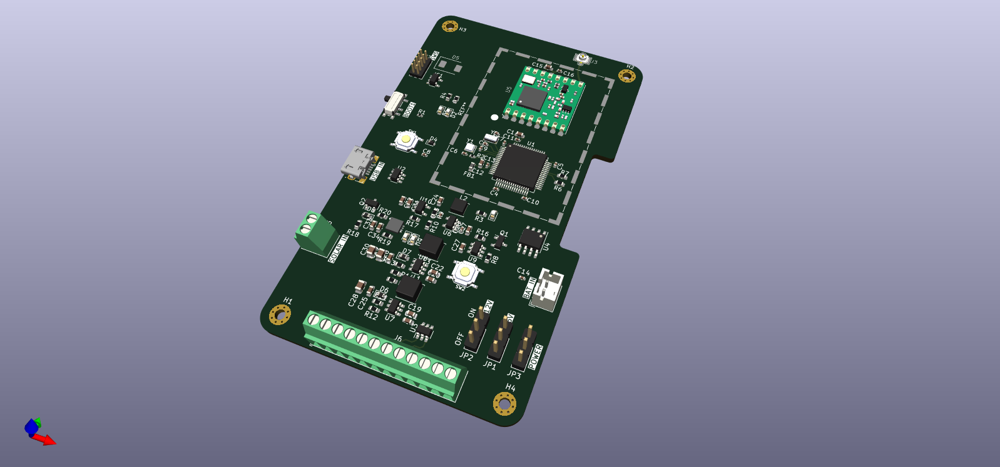

# ST x RFM96 Board (Project discontinued)
This is an STM32 based board that features semtechs LoRa Chip
Some of the features include
- USB connection
- UART, I2C peripherals
- Battery powered
- LoRa Connectivity (RFM96)
- Ultra low power STM32 chip
- Solar power

# Images

# KiCAD
I am using KiCAD v7.0