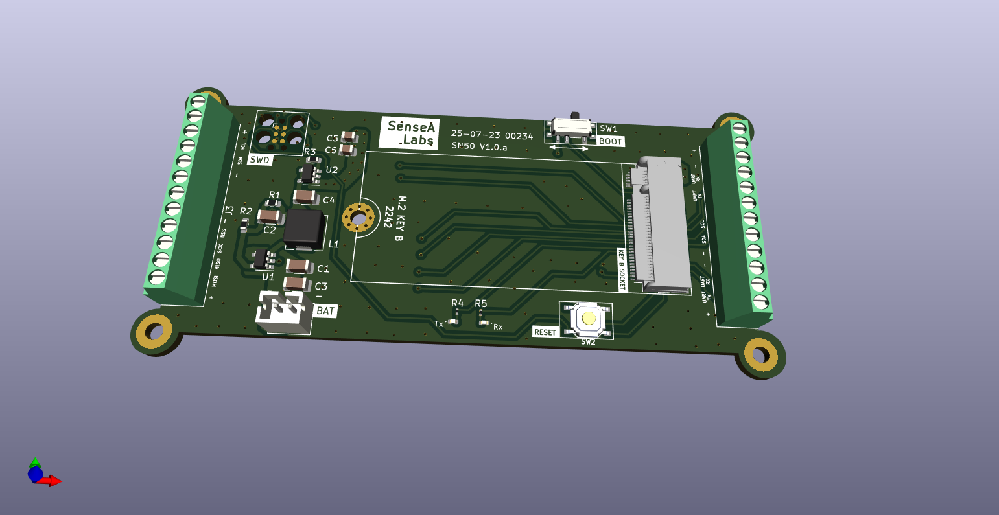
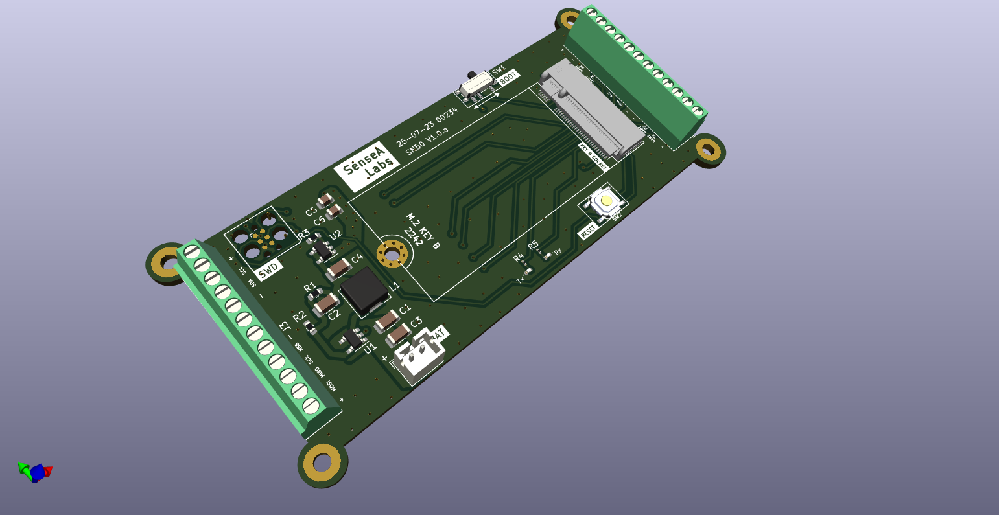
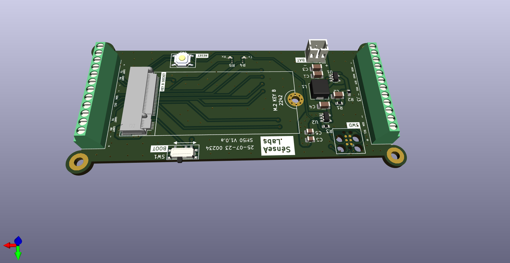
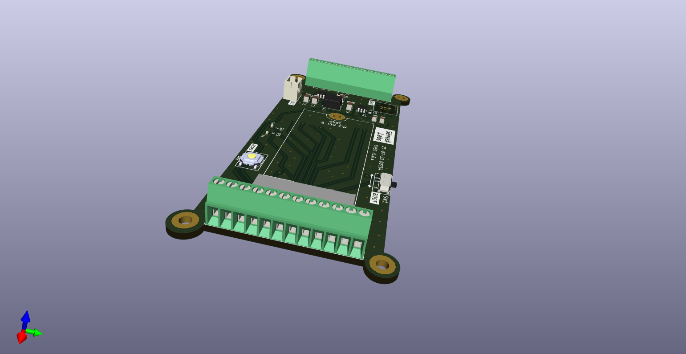

# STLoRa Carrier Board
This is a carrier board for the M.2 Key B System on Module board I designed.

Some of the features include
- SWD Debugging
- UART, I2C peripherals
- Battery powered
- M.2 Key B connector

# Images

# KiCAD
I am using KiCAD v7.0