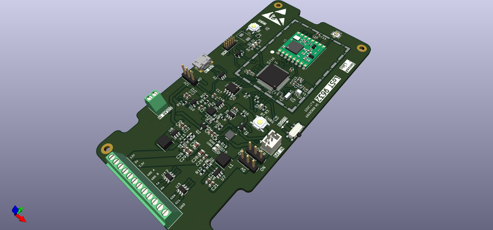
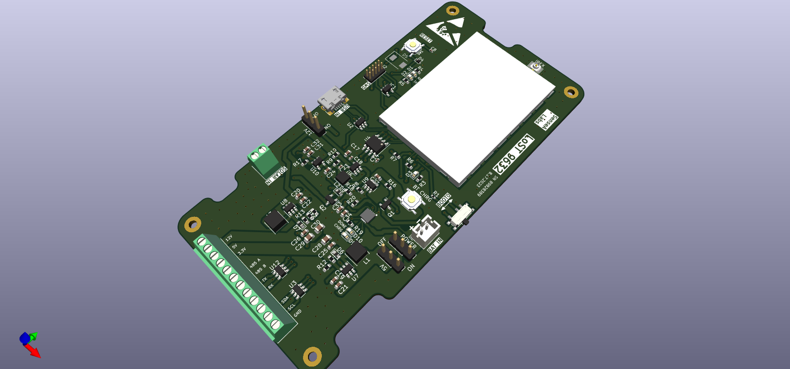
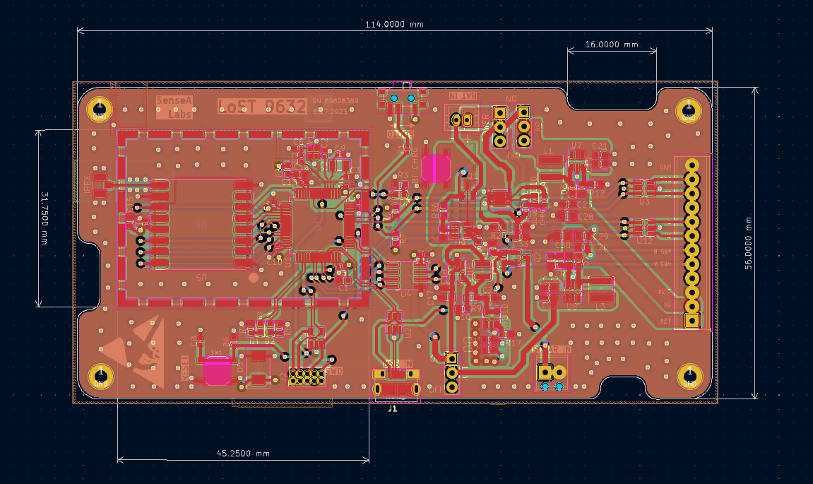
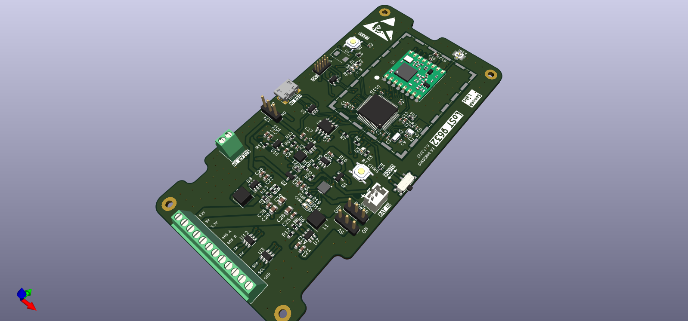

# STM32 X RFM96 Board
This is an STM32 based board that features semtechs LoRa Chip
Some of the features include
- USB connection
- UART, I2C peripherals
- Battery powered
- LoRa Connectivity
- Ultra low power STM32 chip

# Images

# KiCAD
I am using KiCAD v7.0